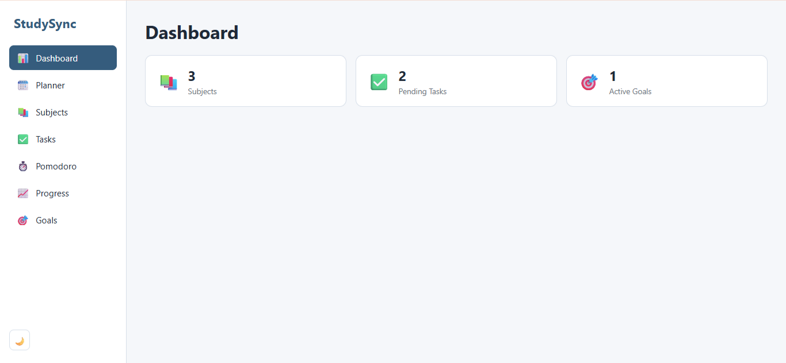
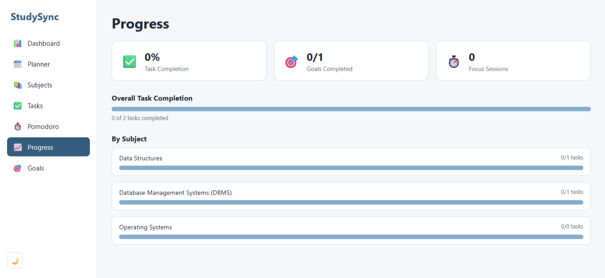
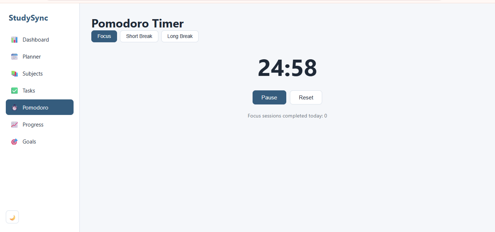
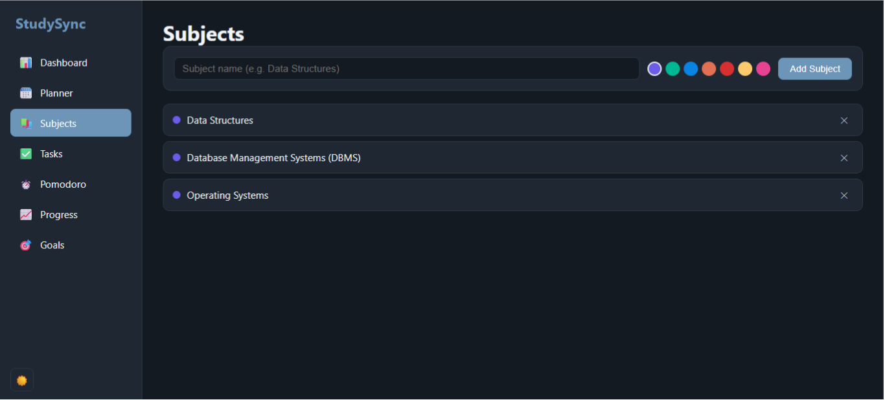

# StudySync

I built StudySync to solve a problem I actually have — juggling subjects, deadlines, and study sessions across sticky notes and random apps. It's a single place to plan what to study, track it, time your focus sessions, and see how you're actually doing over time.

**Live demo:** [studysync-one-jade.vercel.app](https://studysync-one-jade.vercel.app/)

## Screenshots





*Subjects page shown in dark mode to demonstrate the theme toggle.*

## What it does

- **Dashboard** – quick snapshot of your subjects, pending tasks, and active goals
- **Planner** – your tasks, automatically sorted into Overdue / Today / This Week / Later, based on due date
- **Subjects** – add the subjects you're studying, each with its own color so they're easy to spot everywhere else in the app
- **Tasks** – add tasks, link them to a subject, give them a due date, check them off
- **Pomodoro Timer** – focus/break timer that keeps count of how many focus sessions you've actually finished
- **Progress** – how much of your work is done, broken down by subject, with simple progress bars I built myself
- **Goals** – set a target (like "solve 50 DSA problems") and track how close you are
- **Dark / light mode** – because studying at night in a bright white UI isn't fun
- **Works on mobile** – responsive layout, not just desktop
- **Nothing gets lost** – everything's saved in localStorage, so refreshing or closing the tab doesn't wipe your data

## Built with

- React (functional components + hooks, no class components)
- Vite for the dev server/build
- React Router for navigation between pages
- Plain CSS — no Tailwind, no Bootstrap, no component library. I wanted to actually write and understand my own styling
- localStorage for persistence — no backend, no database

I deliberately skipped Redux and Context API here. With this app's size, lifting state up and sharing data through a few custom hooks (details below) was enough, and it kept things easier to reason about.

## Running it locally

```bash
git clone https://github.com/shivartha/studysync.git
cd studysync
npm install
npm run dev
```

Then open `http://localhost:5173`.

## How it's organized

src/
├── components/ # UI pieces, grouped by feature (subjects/, tasks/, pomodoro/, etc.)
├── pages/ # One component per route/page
├── hooks/ # Custom hooks — useLocalStorage, useCountdown, useTheme
├── utils/ # Plain JS helper functions (dates, IDs, stats math)
├── constants/ # Fixed values shared across the app (storage keys, colors, timer lengths)
├── styles/ # Theme variables + global resets
├── App.jsx # Route definitions
└── main.jsx # Entry point

## A few decisions worth explaining

- **No Context API, no Redux.** Every feature reads and writes to the same `localStorage` keys through one shared `useLocalStorage` hook. That's how Tasks and Planner, for example, both stay in sync — they're really just two different views over the same data.
- **Theming through CSS variables.** Every color in the app comes from one set of variables. Flipping dark/light mode just swaps which set of values is active — no component's CSS needed a separate dark-mode version.
- **A custom hook for the timer.** The Pomodoro logic (`useCountdown`) doesn't know anything about "Pomodoro" specifically — it's a generic countdown hook. That was intentional, so it's reusable if I ever add another timer-based feature.

## Known limitations / what I'd fix next

- Deleting a subject that has tasks linked to it doesn't currently clean up those links
- Subjects can be added and deleted, but not edited yet
- Task-toggle/delete logic is duplicated between the Tasks page and the Planner page — could be pulled into a shared hook

## Author

Rachana — [GitHub](https://github.com/shivartha)